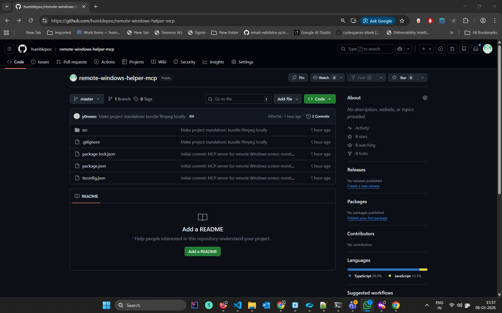
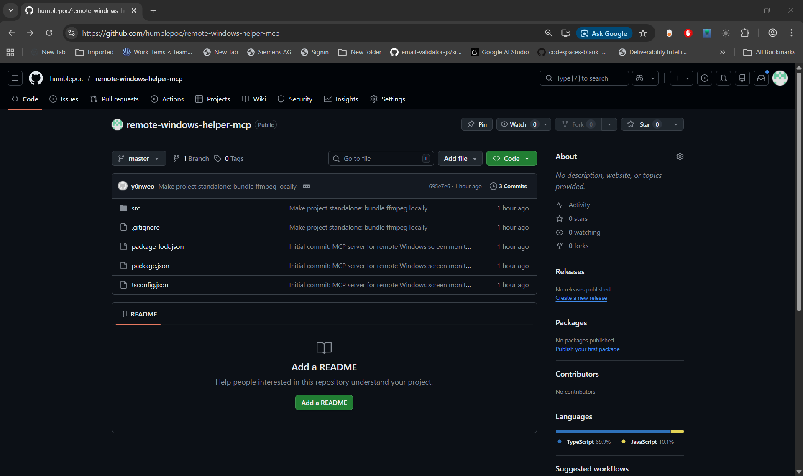

# Remote Windows Helper MCP

A standalone [Model Context Protocol](https://modelcontextprotocol.io/) (MCP) server that gives AI assistants eyes on your Windows desktop. It captures screenshots, records short screen videos, and delivers everything to your Telegram chat -- all through simple tool calls.

Built for use with [OpenCode](https://opencode.ai), [Claude Desktop](https://claude.ai), or any MCP-compatible client.

---

## What It Does

| Tool | Description |
|------|-------------|
| `list_windows` | Enumerate all visible windows with title, app name, position, and dimensions |
| `screenshot_screen` | Capture the entire screen (or a specific monitor) |
| `screenshot_window` | Capture a specific window by title (fuzzy match) |
| `record_screen` | Record 1-30 seconds of screen video as MP4 |

All screenshots and recordings are automatically sent to your **Telegram** chat via Bot API. Screenshots are also returned inline as base64 PNG for the AI to analyze directly.

---

## Samples

### Full Screen Capture

> `screenshot_screen` -- captures the entire primary monitor



### Window Capture

> `screenshot_window` with `window_title: "chrome"` -- captures a specific app window



### Screen Recording

> `record_screen` with `duration_seconds: 3` -- records a short MP4 video

[screen-recording.mp4](assets/screen-recording.mp4)

### Window Listing

> `list_windows` -- returns structured JSON of all visible windows

```json
[
  {
    "id": 4459438,
    "title": "remote-windows-helper-mcp - Google Chrome",
    "app": "Google Chrome",
    "position": { "x": 0, "y": 0 },
    "size": { "width": 1536, "height": 912 },
    "minimized": false
  },
  {
    "id": 1967026,
    "title": "WhatsApp",
    "app": "WhatsApp.Root",
    "position": { "x": -1481, "y": 242 },
    "size": { "width": 1114, "height": 592 },
    "minimized": false
  },
  {
    "id": 3477218,
    "title": "Windows PowerShell",
    "app": "Windows Terminal Host",
    "position": { "x": 1920, "y": 0 },
    "size": { "width": 1920, "height": 1032 },
    "minimized": false
  }
]
```

---

## Setup

### Prerequisites

- **Windows** (uses native `gdigrab` for recording and `node-screenshots` for capture)
- **Node.js** >= 18
- A **Telegram Bot** token and chat ID ([how to create a bot](https://core.telegram.org/bots#how-do-i-create-a-bot))

### Install

```bash
git clone https://github.com/humblepoc/remote-windows-helper-mcp.git
cd remote-windows-helper-mcp
npm install
npm run build
```

### ffmpeg (for screen recording)

Download [ffmpeg](https://www.gyan.dev/ffmpeg/builds/) and place `ffmpeg.exe` in the `ffmpeg/` directory at the project root:

```
remote-windows-helper-mcp/
  ffmpeg/
    ffmpeg.exe      <-- place it here
```

The server auto-detects it from this location. If `ffmpeg.exe` is not found locally, it falls back to your system PATH. The screenshot tools work without ffmpeg -- only `record_screen` requires it.

---

## Configuration

### OpenCode

Add to your `opencode.json` (usually at `~/.config/opencode/opencode.json`):

```json
{
  "mcp": {
    "remote-windows-helper": {
      "type": "local",
      "command": ["node", "/path/to/remote-windows-helper-mcp/build/index.js"],
      "enabled": true,
      "environment": {
        "TELEGRAM_BOT_TOKEN": "your-bot-token",
        "TELEGRAM_CHAT_ID": "your-chat-id"
      }
    }
  }
}
```

### Claude Desktop

Add to your `claude_desktop_config.json`:

```json
{
  "mcpServers": {
    "remote-windows-helper": {
      "command": "node",
      "args": ["/path/to/remote-windows-helper-mcp/build/index.js"],
      "env": {
        "TELEGRAM_BOT_TOKEN": "your-bot-token",
        "TELEGRAM_CHAT_ID": "your-chat-id"
      }
    }
  }
}
```

### Environment Variables

| Variable | Required | Description |
|----------|----------|-------------|
| `TELEGRAM_BOT_TOKEN` | Yes | Your Telegram Bot API token |
| `TELEGRAM_CHAT_ID` | Yes | Chat ID where media will be sent |

Without these variables, the tools still work -- screenshots are returned inline, but nothing is sent to Telegram.

---

## Architecture

```
src/
  index.ts                  # MCP server entry point (STDIO transport)
  tools/
    list-windows.ts         # Enumerate visible windows
    screenshot-screen.ts    # Full screen capture
    screenshot-window.ts    # Window-specific capture
    record-screen.ts        # Screen recording via ffmpeg
  utils/
    windows.ts              # node-screenshots wrapper
    telegram.ts             # Telegram Bot API client
    ffmpeg.ts               # ffmpeg path resolution & recording
```

**Key design decisions:**

- **STDIO transport** -- the MCP client spawns the server as a child process; communication is via JSON-RPC over stdin/stdout
- **No `console.log()`** -- stdout is reserved for JSON-RPC; all logging goes to `console.error()` (stderr)
- **Standalone** -- ffmpeg is bundled in the project directory, no system-wide installation needed
- **Native capture** -- uses [`node-screenshots`](https://github.com/nicehash/node-screenshots) (Rust NAPI addon) for zero-dependency screen and window capture
- **Direct ffmpeg subprocess** -- shells out to `ffmpeg.exe` with `gdigrab` (Windows screen capture driver) instead of using deprecated wrappers

---

## Tech Stack

| Component | Technology |
|-----------|-----------|
| Runtime | Node.js (ES modules) |
| Language | TypeScript |
| MCP SDK | `@modelcontextprotocol/sdk` |
| Screen capture | `node-screenshots` (Rust NAPI) |
| Video recording | ffmpeg + gdigrab |
| Delivery | Telegram Bot API (native `fetch`) |
| Validation | Zod |

---

## License

ISC
